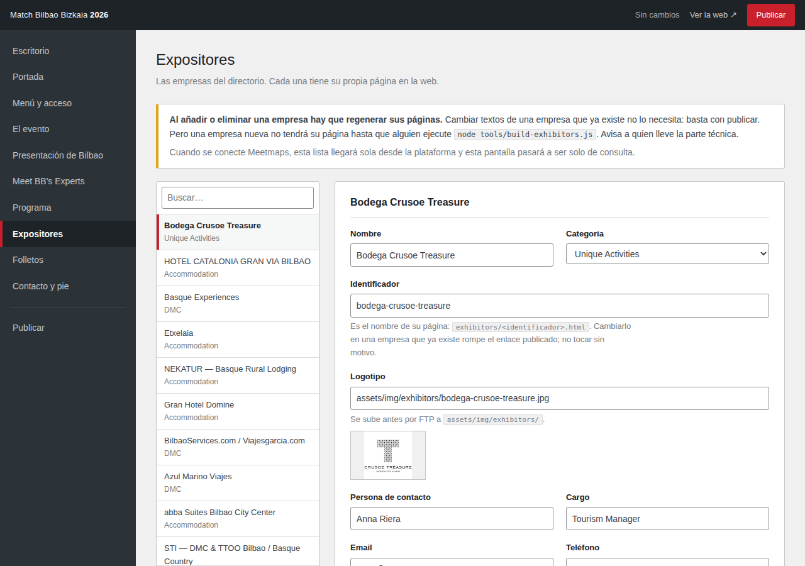

# Panel de administración

Toda la web se edita desde aquí, sin GitHub, sin editar HTML y sin poder romper
el diseño.



---

## Por qué existe

`index.html` no contiene texto. Son 7 KB de armazón: veintiséis caracteres
visibles. Todo lo que se lee en la web —titulares, programa, expositores,
folletos, contacto— vive en cinco archivos de datos:

```
assets/js/data/site.js         menú, portada, login, contacto, pie
assets/js/data/content.js      el evento, presentación de Bilbao, Experts
assets/js/data/programme.js    los días y las sesiones
assets/js/data/exhibitors.js   las empresas del directorio
assets/js/data/discover.js     los folletos
```

Sustituir `index.html` por uno nuevo no actualiza la web: la cambia por otra
distinta y se lleva por delante las páginas de expositor, el programa y el
posicionamiento. El panel edita los cinco archivos de datos y no toca nada más.

---

## Para quien lo usa

**Abrir el panel.** Si está publicado, en `https://…/admin/`. Si no, abriendo
`admin/index.html` con doble clic.

**Editar.** Cada apartado del menú de la izquierda es una parte de la web. Se
puede cambiar lo que haga falta, de una pantalla o de varias.

**Publicar.** El último apartado del menú. Hasta que se pulsa ahí, nada de lo
editado llega a la web.

Según cómo esté montado el hosting, publicar hace una de dos cosas:

- **Guardado directo** — pide una contraseña y escribe en el servidor. Listo.
- **Descarga** — descarga los archivos que han cambiado, y hay que subirlos por
  FTP a la carpeta `assets/js/data/` de la web, reemplazando los que hay.

El panel avisa de cuál de las dos está activa.

### Lo que el panel no hace

- **No sube imágenes.** Se editan las rutas, no los archivos. Una foto o un
  logotipo nuevo se sube antes por FTP a `assets/img/` y en el panel se escribe
  su ruta.
- **No crea páginas de expositor.** Cambiar los textos de una empresa que ya
  existe funciona sin más. Pero **una empresa nueva no tendrá su página** hasta
  que alguien ejecute `node tools/build-exhibitors.js`. El propio panel lo
  recuerda en esa pantalla.
- **No toca el diseño.** Colores, tipografías y maquetación están en la hoja de
  estilos, fuera de su alcance.

---

## Para quien lo instala

El panel funciona tal cual, en modo descarga, sin configurar nada. El guardado
directo es opcional y necesita PHP.

### 1. Activar el guardado directo

En el servidor, dentro de `admin/`:

```
cp admin-config-sample.php admin-config.php
```

y editar `admin-config.php` para poner una contraseña larga. Esa es la que pide
el panel al publicar.

`admin-config.php` **vive solo en el servidor**: está en `.gitignore`, y el
despliegue automático lo excluye expresamente para no sobrescribirlo ni borrarlo
en cada subida. La contraseña no está en el repositorio ni en su historial.

`assets/js/data/` tiene que ser escribible por PHP. Si no lo es, el panel lo
detecta y se queda en modo descarga.

### 2. Cerrar la carpeta

El panel deja editar la web, así que no debería estar abierto a cualquiera. En
el panel del hosting: **Protección de directorios** (o *Directory privacy*),
elegir la carpeta `admin` y crear un usuario.

El archivo `.htaccess` que acompaña al panel ya hace dos cosas por su cuenta:
impide servir `admin-config.php` pase lo que pase, y marca la carpeta como
`noindex`. `robots.txt` también la excluye.

Sin contraseña de publicación, alguien que encuentre `/admin/` puede ver los
formularios pero no puede escribir nada: el servidor rechaza cualquier intento.
Aun así, conviene cerrar la carpeta.

### 3. Qué acepta el servidor

`save.php` es deliberadamente estrecho. Solo escribe los cinco nombres de
archivo conocidos, solo dentro de `assets/js/data/`, y solo si el contenido
tiene forma de archivo de datos. Cualquier otra cosa —otra ruta, otro nombre,
contenido que no lo parezca, la contraseña equivocada— se rechaza sin escribir.

Antes de reemplazar un archivo guarda el anterior como `<nombre>.js.bak`, así
que un error se deshace renombrando ese archivo.

---

## Cómo escribe los archivos

Cada valor se serializa con `JSON.stringify` y se asigna a su global:

```js
window.MBB.site = {
  "event": { ... }
};
```

JSON es JavaScript válido, así que **un archivo escrito por el panel no puede
salir con un error de sintaxis**. Es el único fallo que de verdad importa cuando
quien publica no lee código: un paréntesis mal puesto deja la web en blanco sin
avisar. Por eso el panel no intenta imitar el estilo escrito a mano de los
archivos originales — la corrección vale más que el formato.

El precio es que los comentarios que había dentro de los archivos se pierden al
reescribirlos. Lo que un mantenedor necesita saber se ha trasladado a la
cabecera que el panel escribe en cada archivo.

---

## Verificado

- Las once pantallas se abren sin errores de consola.
- Abrir el panel y no tocar nada produce cero archivos modificados: el viaje de
  ida y vuelta no altera ni un campo.
- Editando tres cosas, el diff de los archivos generados contiene exactamente
  esas tres y nada más.
- La web servida desde archivos escritos por el panel renderiza igual: 62
  sesiones, 39 logotipos, 16 folletos, sin errores de JavaScript.
- `save.php` rechaza contraseña incorrecta (401), rutas con `../`, nombres
  fuera de la lista, y contenido que no es un archivo de datos; acepta el
  legítimo y deja la copia `.bak`.
